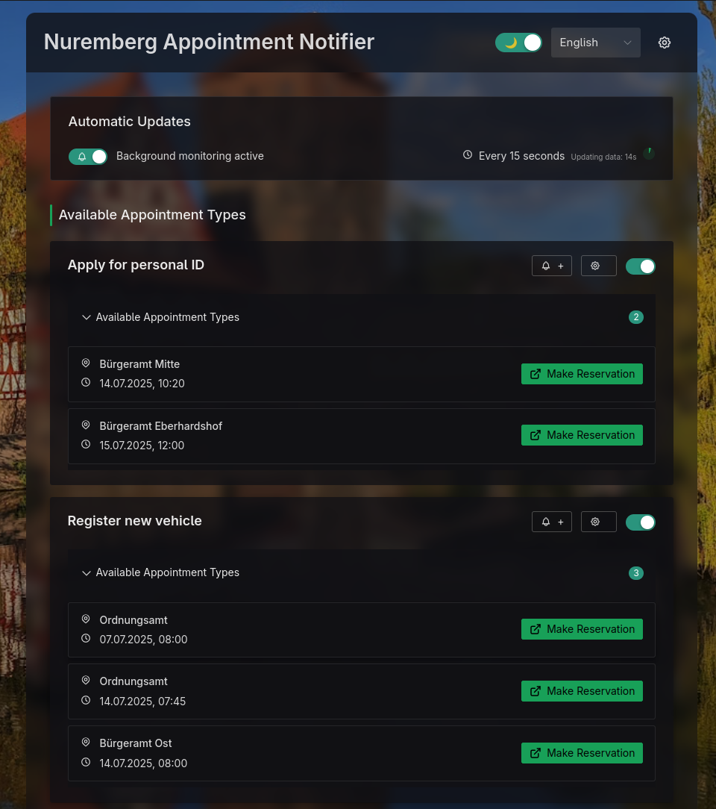

# NBG Termin Notifier

Monitor Nuremberg city service appointments and get notified when slots become available.



## Features

- **Multi-language support**: 🇬🇧 English, 🇩🇪 Deutsch, 🇫🇷 Français, 🇳🇱 Nederlands, 🇷🇺 Русский
- **6 appointment types**: Registration, ID cards, passports, vehicle registration, and more
- **Smart filtering**: Location, day, and time range filters
- **Background monitoring**: Configurable polling with browser notifications
- **Privacy-focused**: GDPR-compliant analytics with consent controls

## Live App

🌐 **[https://faeller.github.io/nbg-termin-notifier/](https://faeller.github.io/nbg-termin-notifier/)**

## Development

```sh
pnpm install
pnpm dev
```

Built with Vue 3, TypeScript, and Naive UI.